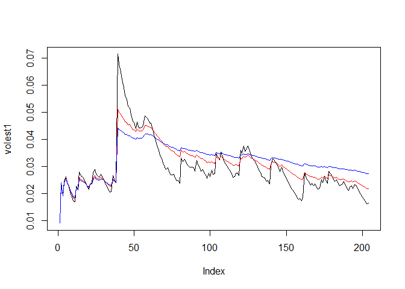

# Volatility of PEN
Dennis Murray  
July 14, 2016  


```r
library(tseries)
MyStockQuote<-get.hist.quote("PEN",quote = "Close")
```

```
## Warning in download.file(url, destfile, method = method, quiet = quiet):
## downloaded length 12495 != reported length 200
```

```
## time series starts 2015-09-21
```

#Calculate log return

```r
MyReturn<-log(lag(MyStockQuote)-log(MyStockQuote))
```

#Calculate volatility

```r
MyVolatility<-sd(MyReturn)*sqrt(250)*100
```
#Calculate volatility with 3 different decay measures


```r
Vol<- function(d,logrets) {
  var = 0
  lam = 0
  varlist <- c()
  for (r in logrets) {
    lam = lam*(1-1/d) + 1
    var = (1-1/lam)*var+(1/lam)*r^2
    varlist<-c(varlist, var)
  }
  sqrt(varlist)
}

volest1<-Vol(10,MyReturn)
volest2<-Vol(30,MyReturn)
volest3<-Vol(100,MyReturn)
```


```r
#Plot the results
plot(volest1, type = "l")
lines(volest2, type = "l", col = "red")
lines(volest3, type = "l", col = "blue")
```

<!-- -->
